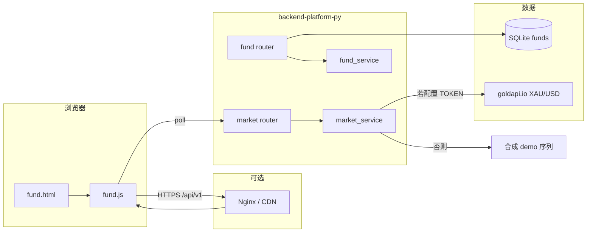

# 09 Fund / 黄金盯盘与估值助手设计说明

本文档描述 `web-sites-hub` 中与 **基金（Fund）占位能力**、**黄金专题前台（fund.html）** 及 **行情接口（Market）** 相关的产品边界、架构、接口契约、配置与商用落地要点。实现代码分散在：

- 前端：`web-sites-hub/frontend-portal/fund.html`、`web-sites-hub/frontend-portal/assets/js/fund.js`
- 后端：`app/routers/fund.py`、`app/routers/market.py`、`app/services/fund_service.py`、`app/services/market_service.py`
- 配置：`app/core/config.py`（`GOLDAPI_IO_TOKEN`）、`deploy/backend-platform-py.env`

---

## 1. 背景与目标

### 1.1 演进关系

| 阶段 | 说明 |
|------|------|
| 早期 | `fund.html` + `fund.js` 为「基金估值助手」演示：本地随机生成基金列表与详情，用于展示技术栈。 |
| 当前 | 页面重心调整为 **黄金专题（Gold Desk）**：国际现货黄金（XAU/USD，美元/金衡盎司）盯盘、人民币折算、持仓损益 **估算**、本机价格提醒；美股/港股/基金期货模块 **暂不开放**，仅 UI 占位。 |
| 后端 | 保留 `GET /api/v1/fund/*` 作为 SQLite 种子数据的列表与 CSV 导出；新增 `GET /api/v1/market/gold/quote` 为金价统一出口（可选对接第三方行情商）。 |

### 1.2 设计目标

1. **商用骨架**：密钥与上游请求放在服务端；前端只调同源 `/api/v1`，便于 Nginx 限流与审计。  
2. **可演示**：未配置行情商 Token 时，返回明确标记的 **演示序列**，避免联调依赖外网付费接口。  
3. **合规表达**：页面显著提示「非投资建议」；工具输出为 **理论价/估算盈亏**，不包含交易所真实点差、递延费、强平等规则。  
4. **可扩展**：预留美股、港股、基金/期货模块入口与文档中的后续迭代清单。

### 1.3 非目标（当前版本不做）

- 不提供实盘下单、开户、KYC、资金托管。  
- 不替代交易所或持牌机构的官方行情终端。  
- 不在浏览器内直连需密钥的付费行情商（避免密钥泄露与 CORS 问题）。

---

## 2. 用户场景与功能范围

### 2.1 典型用户

- 已持有或关注黄金相关资产（现货理念、ETF、T+D、账户金等）的个人投资者，需在 **统一参照价（XAU/USD）** 下做粗粒度盯盘与记账辅助。  
- 技术验证人员：验证反代、CORS、轮询与告警逻辑。

### 2.2 前台能力（fund.html / fund.js）

| 模块 | 行为说明 |
|------|-----------|
| 国际现货黄金盯盘 | 定时请求 `GET /api/v1/market/gold/quote`，展示美元/盎司、涨跌百分比、报价时间、简易走势条（最近若干次采样）。 |
| 人民币理论折算 | 使用用户输入的 **USD/CNY**，将现货美元/盎司换算为 **理论元/克**（公式见 §5.2）。 |
| 估值助手 | 输入持仓克重、持仓均价（元/克）、一次性费用（元），结合当前现货与汇率，估算 **市值与浮动盈亏**。 |
| 价格提醒（本机） | 用户设置美元/盎司上破/下破阈值，持久化在 `localStorage`；仅在价格 **穿越** 阈值时触发 Toast，并可选用 **浏览器 Notification**。 |
| 产品模块卡片 | 黄金专题为当前主线；美股、港股、基金/期货为「即将开放」占位。 |
| 教育表 | 静态说明 AU(T+D)、黄金 ETF、账户金、CFD 等与 XAU 的关系，**非实时行情**。 |

### 2.3 后端能力（与 Fund 名称相关部分）

| 路由 | 说明 |
|------|------|
| `GET /api/v1/fund/list` | 返回数据库 `funds` 表记录列表（种子数据），字段见 §4.2。当前黄金专题页 **未消费** 该接口，保留给历史「基金助手」或其它前台复用。 |
| `GET /api/v1/fund/download` | 返回基金 CSV 文本流，附件名 `funds.csv`。 |
| `GET /api/v1/market/gold/quote` | 返回现货黄金美元/盎司报价结构（演示或上游），见 §4.3。 |

---

## 3. 系统架构

### 3.1 逻辑架构图（Mermaid）



### 3.2 请求路径约定

- **生产**：前端与 API **同源**（例如 `https://showcase.joketop.com` 下静态页 + 同域 `/api/v1` 反代至 Uvicorn）。  
- **本地开发**：`fund.js` 在 `localhost` / `127.0.0.1` / `file:` 时默认 API 根为 `http://127.0.0.1:8300/api/v1`（与诗词页同源策略类似）。  
- **显式覆盖**：在加载 `fund.js` 之前设置 `window.FUND_API = { baseUrl: "https://example.com/api/v1" };`（`baseUrl` 勿带末尾 `/` 后的多余斜杠，脚本内会做规整）。

### 3.3 与「基金」命名的关系

- 历史入口与路径仍使用 **fund** 文件名与路由前缀，避免已发布链接失效。  
- **业务上**当前 showcase 描述已对齐「黄金估值与盯盘助手」；数据库 `fund` 表仍为独立占位域，与金价接口 **解耦**。

---

## 4. 接口契约

### 4.1 统一响应外壳

与全站一致（见 `docs/02-api-design.md`、`app/core/response.py`）：

```json
{
  "success": true,
  "code": "OK",
  "message": "ok",
  "data": {}
}
```

### 4.2 `GET /api/v1/fund/list`

- **鉴权**：无（公开列表，仅演示数据）。  
- **data**：`array`，元素示例：

```json
{
  "code": "000001",
  "name": "示例基金",
  "nav": 1.0234,
  "change": 0.12
}
```

- **数据来源**：`FundModel` → `sqlalchemy_repo.list_funds()`。

### 4.3 `GET /api/v1/market/gold/quote`

- **鉴权**：无（公开行情出口；商用时建议在前缘 **限流**，见 §7）。  
- **data** 字段说明：

| 字段 | 类型 | 说明 |
|------|------|------|
| `symbol` | string | 如 `XAUUSD` |
| `metal` | string | `XAU` |
| `currency` | string | `USD` |
| `unit` | string | 固定含义：`troy_oz`（金衡盎司） |
| `price_usd_oz` | number | 美元/金衡盎司 |
| `change_abs` | number | 与演示或上游定义相关的涨跌绝对值（演示为相对上一合成点） |
| `change_percent` | number | 涨跌百分比 |
| `as_of_ms` | integer | 报价时间 Unix 毫秒时间戳 |
| `source` | string | `demo_synthetic` 或 `goldapi.io` |
| `demo` | boolean | `true` 表示非上游实盘序列 |
| `upstream_error` | boolean | 配置了 Token 但上游失败、已回退演示时为 `true` |
| `upstream_status` | integer | 可选，上游 HTTP 状态码 |
| `upstream_body` | string | 可选，上游错误体截断 |
| `grams_per_troy_oz` | number | 常量 `31.1034768`，供前端与文档对齐 |

- **上游对接**：若环境变量 `GOLDAPI_IO_TOKEN` 非空，`market_service` 使用 `requests` 调用 `https://www.goldapi.io/api/XAU/USD`，请求头 `x-access-token: <token>`。响应字段映射以实现代码为准（`price`、`chp`、`prev_close_price`、`timestamp` 等）。  
- **演示模式**：Token 为空或请求异常时返回 `_demo_quote()`：基于时间的正弦组合波动，**不**代表任何真实市场。

### 4.4 `GET /api/v1/fund/download`

- **响应**：`text/csv`，`Content-Disposition: attachment; filename=funds.csv`。  
- **用途**：运维或演示导出种子基金数据。

---

## 5. 前端逻辑与计算公式

### 5.1 轮询

- 默认间隔 **45 秒**（`POLL_MS` in `fund.js`）。  
- 使用 `fetch` + `AbortSignal.timeout(12000)`。  
- 失败时在页面状态区提示检查后端与 Nginx 反代。

### 5.2 人民币理论元/克

\[
\text{CNY/g} = \frac{\text{price\_usd\_oz}}{\text{grams\_per\_troy\_oz}} \times \text{USD/CNY}
\]

其中 `grams_per_troy_oz = 31.1034768`。  
**说明**：未扣减银行点差、跨境价差、增值税/加工费；用户输入的 USD/CNY 需自行按中行或实际成交汇率更新。

### 5.3 持仓浮动盈亏（估算）

\[
\text{market\_value} = \text{grams} \times \text{CNY/g}
\]
\[
\text{cost\_basis} = \text{grams} \times \text{avg\_cost\_cny\_per\_g} + \text{fee\_cny}
\]
\[
\text{pnl} = \text{market\_value} - \text{cost\_basis}
\]

### 5.4 价格提醒状态机

- 持久化键：`gold-desk-alerts-v1`（阈值）、`gold-desk-last-cross-v1`（防重复触发状态）。  
- **上破**：存在上一采样价 `prev` 且 `prev < high` 且当前 `price >= high` 时触发一次；当 `price < high - 0.25`（美元/盎司）时清除闩锁，允许再次上破提醒。  
- **下破**：对称逻辑（`prev > low` 且 `price <= low`，复位 `price > low + 0.25`）。  
- 首次拉价无 `prev` 时不触发，避免一进入页面就误报。

---

## 6. 配置与环境变量

| 变量 | 作用域 | 说明 |
|------|--------|------|
| `GOLDAPI_IO_TOKEN` | 服务端 | 非空则请求 goldapi.io；**禁止**写入前端仓库或静态页。 |
| `CORS_ALLOW_ORIGINS` | 服务端 | 必须包含实际托管 `fund.html` 的 HTTPS 源，否则浏览器跨域失败。 |
| `window.FUND_API.baseUrl` | 浏览器 | 可选，强制指定 API 根路径。 |

部署示例见 `deploy/backend-platform-py.env` 注释。

---

## 7. 安全、限流与商用建议

1. **密钥**：仅进程环境变量或密钥管理服务；日志中勿打印 Token。  
2. **限流**：在 Nginx 对 `location /api/v1/market/` 配置 `limit_req`；或对全 `/api/v1` 统一配额，防止刷爆上游计费与源站 CPU。  
3. **缓存（可选）**：对 `gold/quote` 在 Nginx 或应用侧做 **短缓存**（如 5～15 秒），降低上游 QPS；注意 `Cache-Control` 与个性化无关，该接口无用户态。  
4. **法律与产品**：页面保留「非投资建议」声明；若对公众开放，需法务审核文案与数据商协议。  
5. **观测**：对 `upstream_error` 比例、延迟、429 做监控，便于切换备用行情商。

---

## 8. 数据与存储

| 存储 | 内容 |
|------|------|
| SQLite `funds` | 基金种子数据，供 `/fund/list` 与 CSV。 |
| 浏览器 `localStorage` | 黄金提醒阈值与穿越闩锁；不涉及服务端用户数据。 |

---

## 9. 测试清单（建议）

- [ ] 未设置 `GOLDAPI_IO_TOKEN`：`/market/gold/quote` 返回 `demo: true`，字段完整。  
- [ ] 设置有效 Token：返回 `demo: false`，`source` 为 `goldapi.io`（以实际合同为准）。  
- [ ] 设置无效 Token 或断网：回退演示数据且 `upstream_error: true`（若实现保持）。  
- [ ] `fund.html` 在同源 HTTPS 下轮询正常；本地 `127.0.0.1:8300` 联调正常。  
- [ ] 估值助手：修改克重、汇率、均价，结果随现货更新变化。  
- [ ] 提醒：仅穿越时 Toast/Notification 各测一次；复位阈值后再次穿越可再触发。

---

## 10. 路线图（文档级，非承诺）

| 优先级 | 项 | 说明 |
|--------|----|------|
| P1 | 上金所交易日历与主要时段说明 | 文案 + 可选时区组件。 |
| P2 | 黄金 ETF 折溢价 | 需额外合法数据源与计算定义。 |
| P3 | 用户登录后云端同步提醒条件 | 需账号体系与推送通道。 |
| P4 | 美股 / 港股 / 期货模块 | 独立数据源合规评估后再开放入口。 |

---

## 11. 相关文档索引

- `docs/02-api-design.md` — API 一览。  
- `docs/04-runbook.md` — 启动与数据库种子。  
- `docs/08-server-deployment.md` — Nginx 与 HTTPS。  
- 前端入口：`web-sites-hub/frontend-portal/showcase.html` 中黄金助手卡片链接至 `fund.html`。

---

## 12. 修订记录

| 日期 | 摘要 |
|------|------|
| 2026-04 | 初版：黄金专题、`market/gold/quote`、与既有 `fund` 路由关系说明。 |
